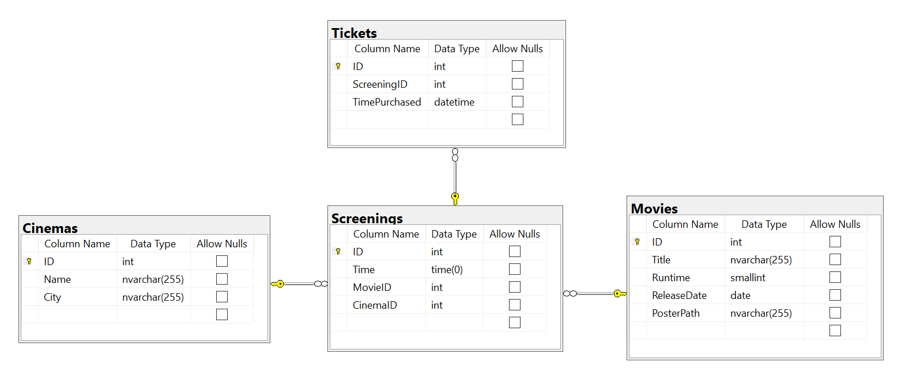
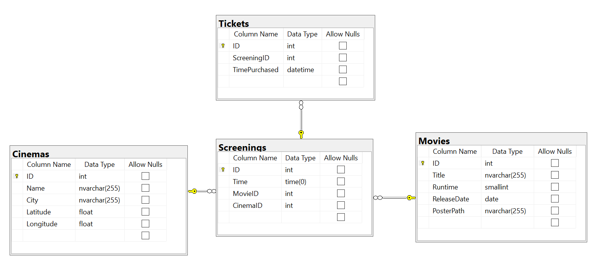

# Inlämningsuppgift 3: GUI-program
Skriv ett GUI-program som låter användaren boka biobiljetter på olika biografer. Utgå från startkoden i [`MainWindow.xaml.cs`](Assignment3/Assignment3/MainWindow.xaml.cs).

Startkoden är ett fullt fungerande program, men den behöver anpassas för att kommunicera med databasen via Entity Framework istället för med ren SQL. För VG behöver också ny funktionalitet läggas till.

För att se hur programmet fungerar, kör det själva efter att ha gjort följande:

1. Skapa en ny databas (exempelvis med Management Studio) med namnet `DataAccessGUIAssignment`.
2. Skapa på egen hand de tabeller som ni ser i diagrammet längre ner eller utgå från följande SQL-kod: [`CreateDatabase.sql`](CreateDatabase.sql).
3. Fyll databasen genom att köra [`PopulateDatabase`](Assignment3/PopulateDatabase), som hämtar filmer och biografer från CSV-filer men slumpgenererar föreställningar. (Om ni kör `PopulateDatabase` två gånger så kommer ni alltså att få samma filmer och biografer men annorlunda föreställningar.)

Några kommentarer kring hur programmet fungerar:

- Välj först en stad, sedan en biograf i den staden under `Cinemas`. Dagens föreställningar på den biografen kommer att visas. (Samtliga biografer i detta program är påhittade.)
- För att boka en biljett, klicka på en föreställning under `Screenings`.
- För att avboka en biljett, klicka på den under `My Tickets`.
- Observera att en föreställning enbart innehåller klockslag, inte datum. Detta är enbart för att göra programmet enklare att testa, och er inlämning ska ha samma beteende.

## Krav för G
- All databaskommunikation ska ske via Entity Framework. Ni vet att detta är gjort om ni kan ta bort raden `using System.Data.SqlClient;` och programmet fortfarande fungerar som förut.
- Programmets beteende i övrigt ska förbli exakt likadant.
- Er databasstruktur måste exakt matcha följande diagram:

    

    Utöver det som syns i diagrammet ska även kolumnen `Name` i tabellen `Cinemas` ha ett unique-constraint. (Det ska inte kunna finnas två biografer med samma namn, vare sig i samma stad eller i olika städer.)
- Skriv **individuell** dokumentation på högst 750 ord som beskriver det arbete som ni har gjort. Se rubriken **Dokumentation** längre ned i dokumentet för riktlinjer kring denna.
    - **Ni får inte skriva dokumentationen tillsammans.** Det är dock tillåtet att diskutera med er arbetspartner innan ni skriver, förutsatt att ni sedan skriver den på egen hand.
    - Om du siktar på VG får dokumentationen vara högst 1,500 ord och den behöver då innefatta arbetet från både G-delen och VG-delen.

## Krav för VG
För att kunna få VG behöver ni uppfylla samtliga krav för G samt följande:

### Inläsning av data
Skriv om `PopulateDatabase` så att den använder sig av Entity Framework istället för ren SQL. Gör detta för både inläsningen av filmer och biografer och skapandet av slumpmässiga föreställningar. Se nästa punkt för information om extra data som kommer att behövas i detta steg.

### Biografpositioner
Lägg till ett till alternativ i stadsmenyn: `Cinemas within 100 km`. När detta alternativ väljs ska användaren se samtliga biografer inom 100 km, oavsett stad.

- För att få användarens GPS-koordinater, utgå från koden i [`Geolocation.cs`](Geolocation.cs). Observera att denna kod måste köras asynkront, så att inte programmet riskerar att frysa i väntan på koordinaterna.
    - Ni kan behöva ändra era Windows-inställningar för att detta ska fungera, enligt exempelvis följande instruktioner: [To turn the Windows location settings on or off](https://support.microsoft.com/en-us/windows/windows-location-service-and-privacy-3a8eee0a-5b0b-dc07-eede-2a5ca1c49088#:~:text=To%20turn%20the%20Windows%20location%20settings%20on%20or%20off)
    - Observera att många datorer, i synnerhet desktop- och laptop-datorer, inte har en GPS-sensor och i dessa fall kommer Windows inte att hitta er exakta position. I vissa fall kan Windows till och med tro att ni befinner er i en helt annan stad. I dessa fall kan ni testa er kod genom att tillfälligt hårdkoda er GPS-position. Kom dock ihåg att återställa detta innan ni lämnar in.
- För att få GPS-koordinater till biograferna, använd filen [`SampleCinemasWithPositions.csv`](Assignment3/PopulateDatabase/SampleCinemasWithPositions.csv) vid inläsning (istället för `SampleCinemas.csv`).
- Använd metoden `Geography.Distance` för att beräkna avståndet mellan två platser. Denna metod finns i DLL-filen `GeographyTools.dll`, som redan har lagts till i projektet. Utgå från [instruktionerna för `GeographyTools.dll`](GeographyTools.md).
    - Det går inte att ändra på källkoden i en DLL-fil. Detta är avsiktligt och något som ni måste hantera.
- Er `Cinema`-klass måste använda sig av klassen `Coordinate`, som finns i samma DLL-fil. Det är alltså inte tillåtet att inuti `Cinema`-klassen lagra koordinaterna på annat sätt, exempelvis som två separata `double` eller med en egenskriven klass.
- Om ni inte bor i närheten av några av biograferna i exempeldatan (eller om Windows inte hittar er faktiska position), testa er kod genom att exempelvis lägga till fler biografer, tillfälligt hårdkoda er GPS-position (istället för att hämta den dynamiskt) eller tillfälligt utöka sökavståndet till mer än 100 km. Kom dock ihåg att återställa detta innan ni lämnar in.
- Er databasstruktur måste exakt matcha följande diagram:

    

    Det som skiljer från G-delen är lagringen av GPS-koordinater, och det är alltså **inte** tillåtet att ha en separat tabell som enbart innehåller GPS-koordinater.

## Övrigt
- Skriv all kod i `MainWindow.xaml.cs` (och i `Program.cs` från `PopulateDatabase` om ni gör VG-delen), inklusive era modellklasser och er `DbContext`.
- Ändra på startkoden och dess struktur vid behov, men inte mer än nödvändigt.
- Ni förväntas följa generella riktlinjer kring C# och Entity Framework, inklusive de som vi har tagit upp under kursens gång kring exempelvis variabelnamn, kodformatering och lämpliga sätt att använda olika delar av Entity Framework. Om ni inte gör detta så kan jag kräva komplettering utan att bedöma resten av er inlämning.

## Dokumentation
Riktlinjer för att skriva dokumentation:

- Filformatet ska vara PDF.
- Skriv ditt namn längst upp i dokumentet.
- Ni kan skriva på antingen svenska eller engelska, men välj ett av språken och håll er till det. (Om ni skriver på svenska är det givetvis OK att använda engelska begrepp för programmeringstermer vid behov.)
- Skriv tydligt. Om ni har många stavfel, dålig grammatik, förvirrande textstycken etc. så kan jag kräva komplettering utan att bedöma resten av er inlämning.
    - Även dokumentets formatering ska vara tydlig. Ha svart text på vit bakgrund och välj inga konstiga typsnitt.
- Fokusera på följande punkter:
    - Er övergripande arbetsprocess: Hur tänkte ni på hög nivå när ni utförde omskrivningen av programmet?
    - Viktiga delar av koden: Vilka delar av er kod, exempelvis metoder, är extra viktiga eller centrala?  Varför? (Modellklasserna och `DbContext` räknas inte eftersom vi redan vet att dessa är extra viktiga.)
    - Intressanta utmaningar och designbeslut: Vilka delar var extra svåra, extra intressanta eller ledde till designbeslut där det fanns flera möjliga svar? Varför?
- Dokumentationens målgrupp är någon som är välbekant med originalkoden och med Entity Framework men som vill veta hur just ni har löst denna uppgift. Ägna alltså inget utrymme till att beskriva hur programmet fungerar ur användarperspektiv eller hur grundläggande delar av Entity Framework fungerar.
- Håll er inom ordgränsen: 750 för G och 1,500 för VG.

## Betygsättning
- Möjliga betyg är IG, G och VG.
- Betygsättningen baseras på en helhetsbedömning. För att uppnå ett betyg måste er lösning uppfylla alla krav för det betyget samt i övrigt vara välskriven, både kod och dokumentation.
- Reglerna för komplettering är samma som för tidigare inlämningar.
- Slutbetyg på kursen blir samma som ert betyg på denna inlämning, förutsatt att ni också är godkända på övriga inlämningar.

## Inlämning
1. Gå med i en projektgrupp i PingPong. Ni måste göra detta även om ni arbetar med samma person som till förra inlämningen.
    - [Länk för Uddevalla](https://yh.pingpong.se/courseId/13390/projectGroupsList.do)
    - [Länk för Gävle](https://yh.pingpong.se/courseId/12295/projectGroupsList.do)
2. Lämna in `MainWindow.xaml.cs` via PingPong.
    - [Länk för Uddevalla](https://yh.pingpong.se/courseId/13390/content.do?id=6213376)
    - [Länk för Gävle](https://yh.pingpong.se/courseId/12295/content.do?id=6213574)
3. Om ni har gjort VG-delen, lämna också in `Program.cs` (från `PopulateDatabase`) på samma ställe som föregående punkt.
    - Det går inte att lämna in flera filer samtidigt; gör helt enkelt två separata inlämningar.
4. Lämna in er individuella dokumentation var för sig via PingPong.
    - Kom ihåg att skriva ditt namn längst upp i dokumentet.
    - [Länk för Uddevalla](https://yh.pingpong.se/courseId/13390/content.do?id=6213397)
    - [Länk för Gävle](https://yh.pingpong.se/courseId/12295/content.do?id=6213577)